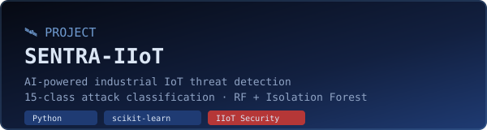
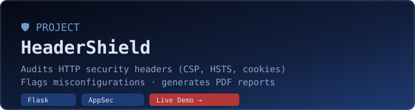
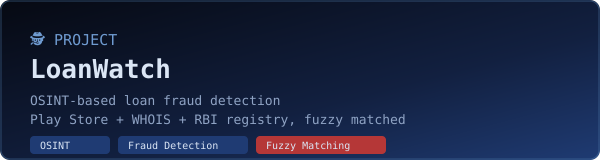
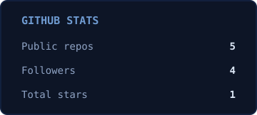
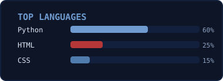

## 🌩️ About

> *Every system has a final boss. I just show up early to meet it — gauntlet already on.*

- 🎓 M.Sc. Artificial Intelligence & Cyber Security, CHRIST (Deemed to be University), Bengaluru
- ⚔️ VAPT, web application security, network security, digital forensics
- 🤖 Applying ML to intrusion detection and threat analysis
- 📍 Bengaluru, India

<table>
<tr>
<td width="50%" valign="top">

**⚔️ Offense**
- Vulnerability Assessment & Pen Testing (VAPT)
- Web Application & Network Security
- OWASP Top 10 exploitation & defense
- OSINT & threat reconnaissance
- Currently Level 3 on Hack The Box

</td>
<td width="50%" valign="top">

**🛡️ Defense**
- Digital Forensics & Incident Response
- Log Analysis & Threat Monitoring
- AI-assisted Intrusion Detection
- ML for Security: Random Forest · Isolation Forest
- Turning noise back into signal

</td>
</tr>
</table>

### ⚙️ Toolkit

### 🔧 Stack

## 🚀 Projects

## 📜 Certifications

- 🛡️ CompTIA Security+ (Enterprise Security Capabilities, Fundamental Security Concepts, Security Goals & Controls)
- 🌐 Web Application Security — Microsoft / Coursera
- ⚔️ OWASP Top 10: Web Application Security — Infosys Springboard
- 🐧 Red Hat System Administration (RH124 & RH134)

## 📊 GitHub Stats

<!--
Optional: contribution snake animation, recolored to match the theme.
1. Add the workflow from https://github.com/Platane/snk to this repo (.github/workflows/snake.yml)
2. Set the palette to shades of #060912 → #1f3b73 → #b53737 in the workflow args
3. It will generate github-contribution-grid-snake.svg on a schedule
4. Then uncomment the line below

-->

## 🌐 Connect

